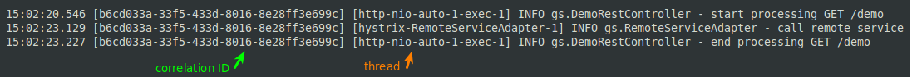

= spring-hystrix-correlation-id

correlation ID implementation with Spring and Hystrix-Javanica

NOTE: As a prerequisite, the reader should have a basic understanding of Spring and the Hystrix circuit-breaker.

== What is a correlation ID ?

When working with micro-services, tracing the root cause of an issue may not be easy.
Processing a request may involve sub-requests to other applications, which in turn generate their own sub-requests.

This is where a correlation ID can help.
A correlation ID is a unique identifier attached to all the requests performed to resolve a higher level request.
If all the applications print logs with this ID, we can aggregate all the logs related to a higher level request.

This practice is sometimes refered as "distributed tracing".

== How does it work ?

Two rules allow the propagation of correlation IDs:

. When an application receives a request with a correlation ID header, this ID should be sent with any outgoing sub requests.
This is demonstrated by `DemoTests.correlation_ID_is_passed_across_services()`.

[source,java]
----
@Test
public void correlation_ID_is_passed_across_services() {

    // initialize mock server, expecting a request with a specific correlation ID
    mockServer.expect(requestTo("http://remote/service"))
            .andExpect(header("X-Correlation-ID", "123e4567-e89b-12d3-a456-426655440000"))
            .andRespond(withSuccess());

    // call demo with correlation ID
    httpGet("/demo", headers("X-Correlation-ID", "123e4567-e89b-12d3-a456-426655440000"));

    // verify expectations
    mockServer.verify();
}
----

[start=2]
. If no correlation ID was provided by the caller, it must be generated. This is demonstrated by `DemoTests.correlation_ID_is_generated_if_missing()`.

[source,java]
----
@Test
public void correlation_ID_is_generated_if_missing() {

    // initialize mock server, expecting a request with any correlation ID
    mockServer.expect(requestTo("http://remote/service"))
            .andExpect(header("X-Correlation-ID", anything()))
            .andRespond(withSuccess());

    // call demo without correlation ID
    httpGet("/demo", noHeaders());

    // verify expectations
    mockServer.verify();
}
----

=== Guidelines

As a guideline, we don't want to pollute our business code with cross cutting concerns.
So the correlation ID implementation should be isolated from the rest of the code.

In the following code, we couldn't guess that a correlation ID is passed along with each requests.

[source,java]
.DemoRestController.java
----
@RestController
public class DemoRestController {

    private static Logger LOGGER = LoggerFactory.getLogger(DemoRestController.class);

    @Autowired
    private RemoteServiceAdapter adapter;

    @GetMapping("/demo")
    public void demo() {
        LOGGER.info("start processing GET /demo");
        // call hystrix command
        adapter.callRemote();
        LOGGER.info("end processing GET /demo");
    }
}
----
[source,java]
.RemoteServiceAdapter.java
----
@Service
public class RemoteServiceAdapter {

    private static Logger LOGGER = LoggerFactory.getLogger(RemoteServiceAdapter.class);

    @Autowired
    private RestTemplate restTemplate;

    @HystrixCommand
    public void callRemote() {
        LOGGER.info("call remote service");
        restTemplate.getForObject(URI.create("http://remote/service"), String.class);
    }

}
----

=== Implementation

A first idea to store context related data, is to use a `ThreadLocal` variable.
Unfortunately, this won't work with Hystrix's default isolation strategy, where a separate thread is used to resolve a Hystrix command.

Alternatively, we can use a `HystrixRequestVariable`.
As explained in the javadoc: a HystrixRequestVariable is "similar to ThreadLocal but scoped at the user request level."

So, when the Demo application receives a request, the `HystrixRequestContextInitializerFilter` reads the correlation ID and keeps it as a `HystrixRequestVariable`.
If the correlation ID isn't provided, a random one is generated.
This filter also put the correlation ID in the diagnostic context, so that it can be printed with logs.

To propagate the diagnostic context on Hystrix command's thread, a hook is registered: `AddCorrelationIdToDiagnosticContext`.

To finish, we still need to send the correlation ID with each outgoing requests.
In HystrixConfiguration, a RestTemplate is defined with an interceptor to add the correlation ID to outgoing requests.

And that's it.
When running `DemoTests.correlation_ID_is_passed_across_services()`, the correlation ID is logged on each line, even though several threads are involved.

== resources

* http://samnewman.io/talks/principles-of-microservices/
* https://dzone.com/articles/implementing-correlation-ids-0